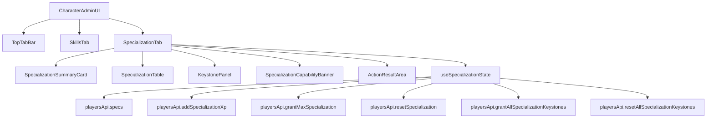
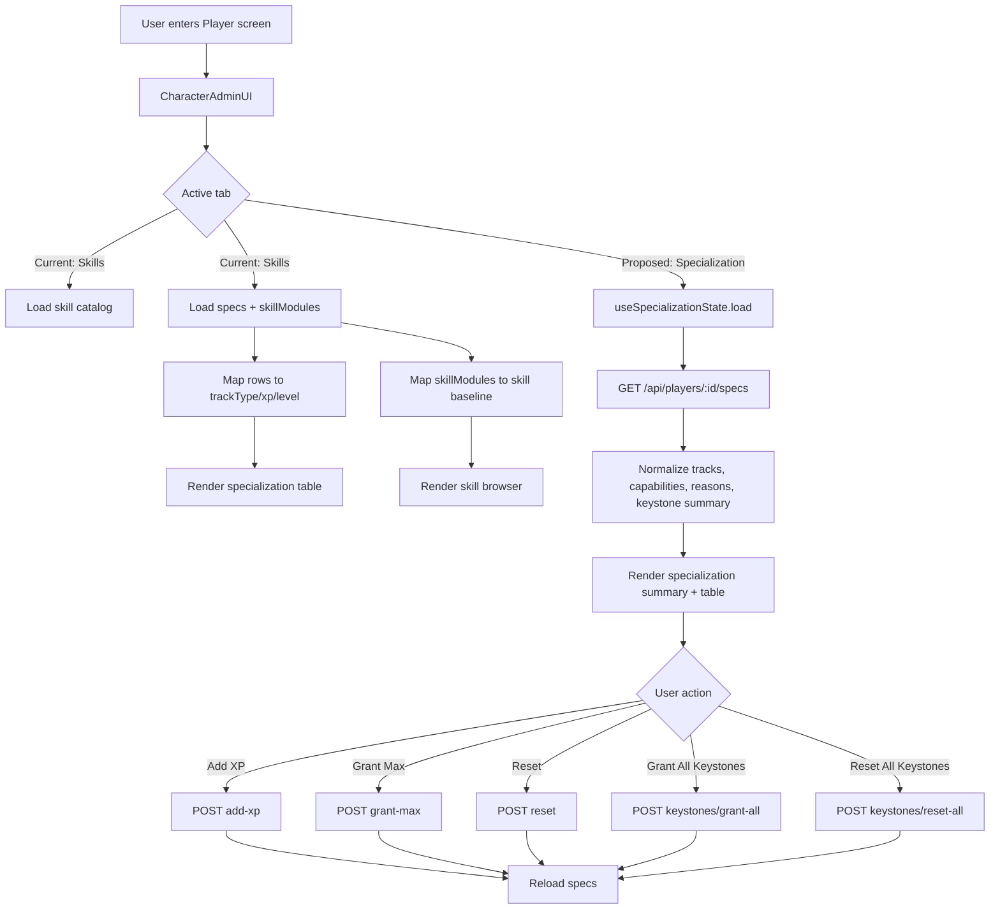
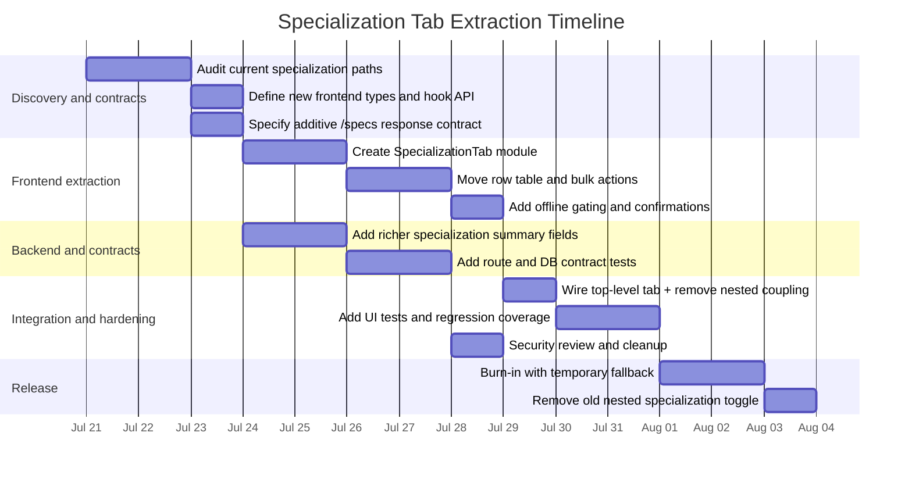

# Roadmap — Dune Awakening Selfhost Docker

## Planned

### Specialization UI Refactor & Feature Expansion

# Deep Research Report on Specialization in yacketrj/dune-awakening-selfhost-docker

## Executive summary

The repository already contains a usable specialization feature, but it is not feature-complete as a standalone product area. In the current implementation, specialization is embedded inside the **Players → select player → Skills** tab as a collapsible block labeled **Specializations** rather than its own first-class tab. The frontend logic, UI rendering, state, and action handlers all live inside the large `console/web/src/features/players/CharacterAdminUI.tsx` module; the client API surface lives in `console/web/src/api/players.ts`; the HTTP routes are wired in `console/api/src/server.js`; and those routes delegate to `console/api/src/duneDb.js` entry points named `playerSpecs`, `addSpecializationXp`, `grantMaxSpecialization`, `resetSpecialization`, `grantAllSpecializationKeystones`, and `resetAllSpecializationKeystones`. 

Functionally, the code supports loading specialization rows, showing track XP and level, adding XP to a track, granting max level for a track, resetting a track, and bulk granting or resetting all keystones. It also reuses the same `/specs` response to hydrate learned skill-module baseline state for the adjacent skill browser. That said, the current design has several notable gaps: specialization is tightly coupled to the Skills tab lifecycle, the UI does not enforce offline-only mutations despite explicitly warning that the player must be offline, high-impact keystone grant lacks a confirmation step, keystone status is not surfaced in the UI, capability/reason metadata from the API is effectively ignored, and there is no visible specialization-specific automated test coverage in the API test tree. 

From a design and architecture perspective, the clearest improvement is to extract specialization into its own tab placed adjacent to **Skills**, backed by its own container component, its own state slice, explicit offline gating, stronger confirmations, better operator affordances, and dedicated tests. This report proposes that design in detail, with security treated as a cross-cutting concern rather than an afterthought. That emphasis is consistent with the repository's own warnings not to expose the Web UI to untrusted users and its active security issue tracking for Semgrep and Trivy findings. 

## Current implementation map

The frontend entry point is `console/web/src/features/players/CharacterAdminUI.tsx`. This file defines the player-admin top-level tabs, where the visible tab list currently includes `Character`, `Crafting`, `Research`, `Skills`, `Journey`, `Blueprints`, and `Admin`. There is no standalone `Specialization` tab in that list today. The same file also defines all specialization-related types, state, data-loading functions, mutation handlers, and the table UI. 

Within the Skills tab, specialization is rendered via a generic toggle-box pattern:

```tsx
playerAdmin_toggleBox("skills_specializations", "Specializations", ...)
```

That proves specialization is currently a nested section inside Skills rather than a sibling tab. The Skills tab also couples specialization loading to the skill browser lifecycle through `playerAdmin_loadSpecializations()` and refresh effects that only run when `playerAdmin_activeTab === "Skills"`. 

The client/API/backend layering is straightforward. The web client exposes `playersApi.specs`, `playersApi.addSpecializationXp`, `playersApi.grantMaxSpecialization`, `playersApi.resetSpecialization`, `playersApi.grantAllSpecializationKeystones`, and `playersApi.resetAllSpecializationKeystones` in `console/web/src/api/players.ts`. On the server side, `console/api/src/server.js` maps the corresponding HTTP paths to `duneDb` functions of the same names, plus `duneDb.playerSpecs` for reads. 

### Exact files, functions, and UI components

| File path | Role | Exact functions or structures | UI/component impact | Evidence |
|---|---|---|---|---|
| `console/web/src/features/players/CharacterAdminUI.tsx` | Frontend specialization container | `SpecializationTrackRow`, `LearnedSkillModuleRow`, `playerAdmin_loadSpecializations`, `playerAdmin_reloadSkills`, `playerAdmin_addSpecializationXp`, `playerAdmin_grantMaxSpecialization`, `playerAdmin_resetSpecialization`, `playerAdmin_grantAllKeystones`, `playerAdmin_resetAllKeystones` | Owns specialization state, loading, mutations, and render tree |  |
| `console/web/src/features/players/CharacterAdminUI.tsx` | Frontend render | `playerAdmin_specializationTable`; `playerAdmin_toggleBox("skills_specializations", "Specializations", ...)`; top tabs array `playerAdmin_tabs` | Renders the visible specialization table inside the Skills tab |  |
| `console/web/src/api/players.ts` | Web API client | `specs`, `addSpecializationXp`, `grantMaxSpecialization`, `resetSpecialization`, `grantAllSpecializationKeystones`, `resetAllSpecializationKeystones` | Defines exact browser-to-API calls used by the UI |  |
| `console/api/src/server.js` | HTTP route wiring | Route handlers delegating to `duneDb.playerSpecs`, `duneDb.addSpecializationXp`, `duneDb.grantMaxSpecialization`, `duneDb.resetSpecialization`, `duneDb.grantAllSpecializationKeystones`, `duneDb.resetAllSpecializationKeystones` | Defines the public API surface used by specialization read/write operations |  |
| `console/api/src/duneDb.js` | Database-layer entry points | `playerSpecs`, `addSpecializationXp`, `grantMaxSpecialization`, `resetSpecialization`, `grantAllSpecializationKeystones`, `resetAllSpecializationKeystones` | Actual database implementation target, visible via route wiring |  |
| `console/web/src/features/players/PlayerCategoryIconRail.tsx` | Supporting future UI utility | `duneCategoryAssetKey` special-cases `"specializations"` to `"all_categories"` | Not currently the specialization screen itself, but relevant to a future distinct tab if reused for iconography or category chrome |  |

### Current component relationship

The present relationship is highly centralized around `CharacterAdminUI`, which makes the specialization feature work but also makes it harder to evolve independently. The diagram below reflects the current code structure and route wiring. 

```mermaid
graph TD
    A[Players UI] --> B[CharacterAdminUI.tsx]
    B --> C[Skills tab]
    C --> D[Specializations toggle box]
    D --> E[playerAdmin_specializationTable]
    D --> F[Add XP / Grant Max / Reset]
    D --> G[Grant All Keystones / Reset All Keystones]
    B --> H[playersApi.specs]
    B --> I[playersApi.addSpecializationXp]
    B --> J[playersApi.grantMaxSpecialization]
    B --> K[playersApi.resetSpecialization]
    B --> L[playersApi.grantAllSpecializationKeystones]
    B --> M[playersApi.resetAllSpecializationKeystones]
    H --> N[/api/players/:id/specs]
    I --> O[/api/players/:id/specializations/add-xp]
    J --> P[/api/players/:id/specializations/grant-max]
    K --> Q[/api/players/:id/specializations/reset]
    L --> R[/api/players/:id/specializations/keystones/grant-all]
    M --> S[/api/players/:id/specializations/keystones/reset-all]
    N --> T[duneDb.playerSpecs]
    O --> U[duneDb.addSpecializationXp]
    P --> V[duneDb.grantMaxSpecialization]
    Q --> W[duneDb.resetSpecialization]
    R --> X[duneDb.grantAllSpecializationKeystones]
    S --> Y[duneDb.resetAllSpecializationKeystones]
```

### Relevant code snippets

A few very small code fragments capture the most important facts:

```tsx
{ label: "Skills", icon: Brain }
```

This confirms that the top navigation currently has **Skills** but not **Specialization**. 

```tsx
playerAdmin_toggleBox("skills_specializations", "Specializations", ...)
```

This confirms specialization is nested beneath Skills. 

```ts
playersApi.addSpecializationXp(playerId, { trackType, amount, confirmation: "ADD SPECIALIZATION XP" })
```

This captures the exact web-client call shape for the per-track XP action. 

## Completeness assessment

My conclusion is that specialization is **operationally useful but not feature-complete**. The key reason is not that the code is absent; it clearly exists and works for core operations. The issue is that specialization has been implemented as an embedded subsection of the Skills screen with limited visibility, incomplete operator safeguards, incomplete read-model richness, and limited evidence of automated regression protection. That is enough for an MVP admin feature, but not enough for a clean, independently maintainable subsystem. 

### Implemented features

The existing specialization feature does provide a meaningful set of capabilities. It loads specialization rows through `playersApi.specs`, maps each row into `trackType`, `xp`, and `level`, and also extracts `skillModules` from the same response to build the adjacent skill baseline state. That same screen renders a table with **Track**, **XP**, **Level**, **Add XP**, **Result**, and **Action** columns. Per track, the operator can add XP, grant max level, or reset the specialization; globally, the operator can grant all keystones or reset all keystones. The screen also supports reload, error presentation, and action-result messages. 

The specialization view is also tied into the broader Skills workflow. When the Skills tab becomes active, the code loads both the skill catalog and specialization data; when the page regains focus or visibility, it refreshes specialization data if there are no unsaved skill changes; and after per-track specialization mutations or starter-skill restoration, it reloads specialization data again. That coupling is one reason the current UX feels coherent to operators, even though it also creates architectural entanglement. 

The repository history also shows adjacent work that shaped the current Skills area. In the visible commit history for `CharacterAdminUI.tsx`, the file was touched by `Add starter skill restore action` at commit `450b39a` and by `feat(players): refine administration navigation and search` at commit `8fe6a3d`, both of which are relevant to how the current Skills-area workflow is organized. 

### Missing features, bugs, and edge cases

The table below lists the most material gaps I identified from the current code, with implementation complexity, affected modules, and suggested fixes. The "missing" label here includes design debt, UX gaps, test debt, and security-significant operator-safety issues.

| Missing item or bug | Why it matters | Complexity | Affected modules | Suggested fix | Evidence |
|---|---|---:|---|---|---|
| No standalone Specialization tab | Specialization is buried under Skills, so navigation, lifecycle, and code ownership are coupled to unrelated skill editing | Medium | `CharacterAdminUI.tsx`, `players.ts`, routing state | Add a new top-level `Specialization` tab and extract logic into a dedicated container component |  |
| Offline-only rule is not enforced in the UI | The UI text says the player must be offline, but buttons remain enabled unless pending or missing `dbPlayerId`, increasing operator error and reload churn | Low | `CharacterAdminUI.tsx` | Disable specialization mutation buttons when the player is online and show an inline reason; keep server-side enforcement authoritative |  |
| Bulk keystone grant has no confirmation | `Grant All Keystones` is high impact but does not prompt for confirmation; reset-all does prompt | Low | `CharacterAdminUI.tsx` | Add `confirmAction` before grant-all, with player name and impact summary |  |
| Keystone state is not visible | Operators can mutate keystones in bulk but cannot see current keystone status, causing blind admin operations | Medium | `CharacterAdminUI.tsx`, `players.ts`, `server.js`, `duneDb.js` | Expand the read model to return keystone status counts/details and render them in the new tab |  |
| `/specs` response is down-mapped to only `trackType`, `xp`, and `level` | Any richer backend data returned by the API is discarded by the UI mapping, which blocks richer specialization views | Medium | `CharacterAdminUI.tsx`, `players.ts` | Introduce a typed specialization view model containing track metadata, keystone summary, unlockability, and last-updated status |  |
| Shared XP input is global, not per-row | A single global XP amount applied across all rows makes accidental edits more likely in busy admin workflows | Low | `CharacterAdminUI.tsx` | Replace the shared input with row-local inputs or a row-local action menu with remembered last value |  |
| Capability/reason metadata is effectively ignored in specialization UI | API types include `capabilities` and `reason`, but the specialization load path maps rows and errors only; unsupported environments are not explained proactively | Medium | `players.ts`, `CharacterAdminUI.tsx` | Surface capability and unsupported-reason banners before mutation attempts |  |
| Keystone actions do not refresh specialization state after success | Per-track actions reload after write, but keystone bulk actions do not call `playerAdmin_loadSpecializations()`; UI consistency depends on manual reload or tab refresh | Low | `CharacterAdminUI.tsx` | After grant/reset all keystones, reload specialization data and any affected derived skill state |  |
| No visible specialization-specific automated tests | The API test tree includes many tests, but none with specialization-related names are visible, increasing regression risk for extraction work | Medium | `console/api/test`, likely web test setup | Add route, permission, reducer/state, and UI interaction tests specifically for specialization |  |
| Specialization remains embedded in a very large monolithic admin file | Large-file coupling slows safe change, encourages regressions, and makes security review harder | Medium | `CharacterAdminUI.tsx` | Split into focused components and hooks: `SpecializationTab`, `useSpecializationState`, `SpecializationTable`, `SpecializationActions` |  |

### Overall completeness verdict

If feature-complete means "does the operator have a minimal path to inspect and mutate specialization tracks," the answer is yes. If feature-complete means "does specialization have dedicated navigation, explicit safety controls, rich read-state, modular boundaries, and regression coverage befitting an admin subsystem," the answer is no. On that broader and more maintainable definition, specialization is **approximately MVP-complete but not product-complete**. 

## Design document for a dedicated Specialization tab

### Design objectives

The design goal is to make Specialization a first-class player-admin area, positioned directly next to Skills in the top tab bar. That change should reduce operator confusion, shrink cognitive load inside the Skills screen, isolate state and data flows, and make future specialization features easier to add without destabilizing adjacent skill editing. It should also improve security and operator safety by making offline requirements explicit, disabling risky actions when state is unsafe, and putting confirmations where the current UI is permissive. Those goals align with the repository's own experimental-state warning and its admonition not to expose the Web UI to untrusted users. 

### Current versus proposed UI structure

| Aspect | Current | Proposed |
|---|---|---|
| Top-level navigation | `Skills` only; specialization nested under Skills | New `Specialization` tab inserted next to `Skills` |
| Screen ownership | `CharacterAdminUI.tsx` monolith | `CharacterAdminUI` hosts tab only; dedicated `SpecializationTab` owns feature |
| Data lifecycle | Loads only when active tab is `Skills` | Loads when active tab is `Specialization`; optional background refresh policy |
| Offline handling | Informational text only | Hard UI disable for unsafe writes, with inline reason and confirmation requirements |
| Keystone visibility | Bulk actions only, no state visibility | Keystone summary plus bulk actions; optional future per-track keystone detail |
| XP action | Shared global amount input | Row-local XP input with remembered defaults |
| Error/capability messaging | Generic reload/error behavior | Dedicated capability banner, unsupported-state banner, action-level result messaging |
| Testability | Hard to isolate | Pure subcomponents, dedicated hooks, dedicated tests |

The current structure is evidenced by the existing tabs array and nested specialization toggle; the proposed structure is the recommended redesign based on those constraints. 

### Proposed component hierarchy

The new hierarchy should make specialization modular without forcing a backend redesign first. The primary extraction is on the frontend. The backend can initially preserve the current endpoints and adapt later if the richer read model is added.



### UI and UX wireframes

#### Desktop wireframe

```text
┌──────────────────────────────────────────────────────────────────────┐
│ Player: <name>                                                      │
│ Tabs: Character | Crafting | Research | Skills | Specialization | … │
├──────────────────────────────────────────────────────────────────────┤
│ [Capability banner / Offline status banner]                         │
│                                                                      │
│  Specialization Summary                                              │
│  • Tracks detected: 5                                                │
│  • Total specialization XP: 123,456                                  │
│  • Keystone state: 4/5 active                                        │
│                                                                      │
│  Bulk Actions                                                        │
│  [Grant All Keystones] [Reset All Keystones] [Reload]                │
│                                                                      │
│  ┌────────────────────────────────────────────────────────────────┐   │
│  │ Track        XP         Level   XP Input   Actions   Result    │   │
│  │ Trooper      12,000     4       [1000]     [+XP]     Success   │   │
│  │ Swordmaster  27,000     7       [1000]     [Max]     —         │   │
│  │ Bene G.      0          0       [1000]     [Reset]   —         │   │
│  └────────────────────────────────────────────────────────────────┘   │
│                                                                      │
│  Optional Details                                                    │
│  [Show keystone / milestone detail]                                  │
└──────────────────────────────────────────────────────────────────────┘
```

#### Tablet/mobile-leaning wireframe

```text
┌───────────────────────────────┐
│ Player: <name>                │
│ Tabs: Skills | Specialization │
├───────────────────────────────┤
│ Offline required for writes   │
│ [Reload] [Bulk Actions ▼]     │
├───────────────────────────────┤
│ Track: Trooper                │
│ XP: 12,000   Level: 4         │
│ [1000] [+XP] [Max] [Reset]    │
│ Result: Success               │
├───────────────────────────────┤
│ Track: Swordmaster            │
│ XP: 27,000   Level: 7         │
│ [1000] [+XP] [Max] [Reset]    │
└───────────────────────────────┘
```

### State management and data flow

Today the Skills tab owns both skill and specialization state, and the refresh effects are keyed to `playerAdmin_activeTab === "Skills"`. The proposed design should split those concerns. A small local hook such as `useSpecializationState` is sufficient; no global store is required unless the player-admin area is already moving toward centralized state for all tabs. The hook should own:

- `tracks`
- `keystoneSummary`
- `loading`
- `error`
- `capabilities`
- `reason`
- `lastReloadAt`
- `rowDraftXpByTrack`
- `pendingActionByTrack`
- `pendingBulkAction`

This split allows the Skills tab to keep skill baseline and unsaved-change behavior, while the Specialization tab manages its own refresh, safety disablement, and optimistic or pessimistic updates. The specialization hook should remain pessimistic by default because these are admin mutations with possible backend rejection and offline-state constraints. The current code base already prefers explicit result messages and reload-after-mutation patterns, so the proposed design fits the established operational model. 

The current and proposed data flow can be summarized like this. The current view is based on the existing client and route wiring; the proposed right-hand branch shows the same APIs behind a dedicated tab. 



### API and database changes

A first migration step can keep the current six specialization API calls exactly as they are. That minimizes backend churn and allows the frontend extraction to land quickly. However, the read endpoint should ideally evolve from a thin `/specs` adapter into a clearer specialization view-model response, still served from the same route for backward compatibility. Today the client type for `specs()` is a composite payload of `rows`, optional `skillModules`, `capabilities`, and optional `reason`. The UI then narrows that payload into only three visible track fields, which is why keystone state and richer capability UX never emerge. 

A compatible evolution path is:

```ts
type PlayerSpecsResponseV2 = {
  rows: Array<{
    track_type: string
    xp_amount: number
    level: number
    keystone_count?: number
    keystone_unlocked?: boolean
    max_level?: number
  }>
  skillModules?: Array<...>
  capabilities: Record<string, unknown>
  reason?: string
  specializationSummary?: {
    trackCount: number
    totalXp: number
    keystonesUnlocked: number
    keystonesTotal: number
  }
}
```

That change preserves `rows`, `skillModules`, `capabilities`, and `reason`, which means the current client can continue to function while the new tab consumes the richer fields when present. Because the route already delegates through existing wrappers in `server.js`, the route surface need not expand unless later product requirements call for keystone-per-track endpoints. 

### Migration plan and backward compatibility

The safest sequence is incremental.

| Phase | Change | Backward compatibility strategy |
|---|---|---|
| Phase A | Add new `Specialization` tab label and render a new container | Keep old nested specialization toggle under Skills behind a temporary internal flag |
| Phase B | Extract specialization state and UI into dedicated components | Use existing `playersApi` endpoints unchanged |
| Phase C | Add richer `/specs` response fields | Preserve legacy `rows` shape and optional `skillModules` |
| Phase D | Remove nested toggle from Skills after burn-in | Leave route contracts unchanged; only frontend rendering changes |
| Phase E | Add specialization-specific tests and telemetry | No user-facing API break |

During burn-in, an internal feature flag such as `ENABLE_SPECIALIZATION_TAB` could render both experiences for maintainers only, or render the new tab while leaving the old toggle hidden behind a fallback. Because the repo is explicitly experimental and warns against exposing the console to untrusted users, this kind of staged rollout is appropriate and low-risk. 

## Architecture and security document

### Proposed module boundaries

The specialization redesign should create a clean module slice rather than adding more logic to `CharacterAdminUI.tsx`. A good minimal target layout is:

| Proposed file | Purpose |
|---|---|
| `console/web/src/features/players/specialization/SpecializationTab.tsx` | Container for tab-level rendering and lifecycle |
| `console/web/src/features/players/specialization/SpecializationSummary.tsx` | Summary metrics and keystone overview |
| `console/web/src/features/players/specialization/SpecializationTable.tsx` | Row table and row-local actions |
| `console/web/src/features/players/specialization/SpecializationRowActions.tsx` | Add XP / Max / Reset controls with confirmations |
| `console/web/src/features/players/specialization/useSpecializationState.ts` | Data hook for loads, reloads, and mutations |
| `console/web/src/features/players/specialization/types.ts` | Track, summary, mutation, and capability types |
| `console/web/src/features/players/specialization/normalizers.ts` | API response normalization and guard helpers |
| `console/api/test/specialization-routes.test.js` | HTTP and permission route tests |
| `console/api/test/specialization-db.test.js` | Database-layer contract tests |
| `console/web/src/features/players/specialization/*.test.tsx` | UI interaction and state tests |

This architecture directly reduces the blast radius of changes that are currently concentrated in `CharacterAdminUI.tsx`. That matters because the file already owns multiple unrelated player-admin domains, including crafting, research, journey, inventory, vehicle operations, and admin actions. 

### Interfaces and data models

The frontend should stop treating specialization as a mere array of rows and instead use explicit models.

```ts
type SpecializationTrack = {
  trackType: string
  xp: number
  level: number
  maxLevel?: number
  keystoneUnlocked?: boolean
  keystoneCount?: number
  writable: boolean
}

type SpecializationSummary = {
  trackCount: number
  totalXp: number
  keystonesUnlocked: number
  keystonesTotal: number
  offlineRequired: boolean
}

type SpecializationCapabilities = {
  canRead: boolean
  canMutate: boolean
  canGrantKeystones: boolean
  canResetKeystones: boolean
  reason?: string
}
```

Using these models makes the UI safer. It lets the screen render `writable: false` when the player is online or when capability metadata denies an operation, rather than relying on ad hoc button expressions. It also makes security review easier because the allowable state transitions become explicit in one place instead of being scattered across inline JSX and free-form mutation calls. The need for this is visible today because specialization writes are guarded only by `!dbPlayerId || playerAdmin_actionResult?.pending` at the button level, while the user-facing copy says the player must be offline. 

### Deployment impact

The frontend-only extraction is low deployment risk. It preserves route shapes, does not require DB migrations, and should ship in the same web bundle path already used by the player-admin panel. The backend payload extension for `/specs` is also low-to-medium risk if it is additive and leaves the current `rows` and `skillModules` intact. Docker, runtime orchestration, and environment assumptions do not need to change for this feature. That conclusion is consistent with the README description of the system as a browser admin panel layered over self-hosted server operations, and with the modular `console/api` / `console/web` split already in place after the `3e9b181` refactor. 

### Testing strategy

The current visible API test tree is extensive, but it does not show specialization-specific tests by filename. That means the extraction should intentionally add them rather than assuming related player tests will cover the feature. 

The recommended test matrix is:

| Test layer | What to test |
|---|---|
| Unit: normalizers | `rows` and `skillModules` parsing, capability fallback, malformed row handling |
| Unit: reducers/hook | load success, load failure, button-disable state, pending-action transitions |
| Component: table | row rendering, row-local XP input behavior, offline disablement, result messages |
| Component: bulk actions | confirmation modals for grant/reset all keystones |
| Integration: web client | `playersApi` contract for all specialization endpoints |
| API route tests | permissions, unsupported capability handling, 4xx validation for bad `trackType` / amount |
| DB/service tests | mutation behavior, idempotence where appropriate, keystone summary correctness |
| Security tests | online/offline enforcement, unauthorized access rejection, confirmation-as-UX-not-auth guard posture |

### Security considerations

Security should guide the redesign from the first commit. The repository already treats security as an active concern: the README warns not to expose the Web UI to untrusted users, to keep internal admin ports private, and the issue tracker shows open vulnerability and scan-tracking items such as issue `#67` (Trivy), issue `#41` (Semgrep), and other security-labeled findings. 

Within specialization specifically, the most important security and safety principles are these:

First, **server-side authorization must remain authoritative**. The frontend currently sends constant confirmation strings like `"ADD SPECIALIZATION XP"` and `"GRANT MAX SPECIALIZATION"` through `playersApi`, but those strings are operator UX aids, not a meaningful security boundary. The server routes already delegate through centralized wrappers in `server.js`, and that pattern should remain the real enforcement point. 

Second, **offline-only constraints should be enforced twice**: once in the UI to prevent accidental writes, and again on the backend to prevent stale, scripted, or malicious requests from bypassing the UI. The current screen communicates the offline requirement in text yet still leaves action buttons enabled, which is a classic operator-safety gap. 

Third, **dangerous mutations need confirmation and auditability**. Reset actions already ask for confirmation in some cases; bulk keystone grant should do the same. All specialization writes should also keep using the existing action log patterns already present in `CharacterAdminUI`, because reliable operator audit trails are a security control in admin consoles, not merely a UX nicety. 

Fourth, **inputs should be validated and constrained**. `trackType` should come from a current-server allowlist derived from `/specs` or from backend validation, XP amount should be numeric and within sane bounds, and per-row draft inputs should be cleared or namespaced by player ID so stale values cannot bleed between selected players. The current code already resets some skill state on `actionPlayerId` change; the new specialization slice should do the analogous thing for all draft specialization inputs. 

## Implementation timeline and Qwen prompt

### Delivery timeline

The implementation can be done safely in about two engineering weeks of focused work, with testing and security review built into each stage rather than deferred to the end.



### Ready-to-use Qwen3.6 prompt

```text
You are implementing a refactor and feature expansion in the repository yacketrj/dune-awakening-selfhost-docker.

Goal:
Move the existing Specializations UI out of Players -> select player -> Skills and into its own first-class tab next to Skills, while preserving all current behavior, improving safety, and adding regression tests.

Repository facts you must respect:
- Current frontend specialization logic lives inside:
  - console/web/src/features/players/CharacterAdminUI.tsx
- Current client API calls live inside:
  - console/web/src/api/players.ts
- Current backend route wiring lives inside:
  - console/api/src/server.js
- Current backend delegates specialization calls to duneDb functions:
  - playerSpecs
  - addSpecializationXp
  - grantMaxSpecialization
  - resetSpecialization
  - grantAllSpecializationKeystones
  - resetAllSpecializationKeystones
- Current top tabs include:
  - Character, Crafting, Research, Skills, Journey, Blueprints, Admin
- Current specialization is rendered as a nested toggle box:
  - playerAdmin_toggleBox("skills_specializations", "Specializations", ...)
- Current specialization features already implemented:
  - load specialization rows from /api/players/:id/specs
  - show trackType, xp, level
  - add specialization XP per track
  - grant max specialization per track
  - reset specialization per track
  - grant all keystones
  - reset all keystones
- Current issues to fix:
  - specialization is not its own tab
  - offline-only writes are explained in text but not enforced in the UI
  - Grant All Keystones lacks confirmation
  - keystone state is not visible
  - specialization state is tightly coupled to Skills tab lifecycle
  - specialization lacks clear dedicated tests
  - keep security in scope throughout

Implementation requirements:
1. Frontend extraction
- Create a dedicated specialization module folder under:
  console/web/src/features/players/specialization/
- Add at least:
  - SpecializationTab.tsx
  - SpecializationTable.tsx
  - SpecializationSummary.tsx
  - SpecializationRowActions.tsx
  - useSpecializationState.ts
  - types.ts
  - normalizers.ts
- Keep code small, typed, and testable.
- Refactor CharacterAdminUI.tsx so it adds a new top-level tab labeled "Specialization" immediately next to "Skills".
- Remove specialization rendering from the Skills tab after the new tab is wired and tested.
- Preserve current action logging and inline result patterns where reasonable.

2. UX and safety
- Add hard UI disablement for specialization write actions when the player is online.
- Show an inline explanatory banner when writes are disabled due to online state.
- Add confirmAction for:
  - Grant All Keystones
  - Reset All Keystones
  - Grant Max per track
  - Reset per track
- Convert the current shared global XP input into a row-local XP input per specialization row.
- Keep reload behavior explicit and user-driven, with automatic reload after successful writes.

3. Data model and API compatibility
- Keep existing playersApi methods compatible.
- If you extend /api/players/:id/specs, do so additively only.
- Preserve existing fields:
  - rows
  - skillModules
  - capabilities
  - reason
- Add a richer optional specialization summary object if needed.
- Do not break old callers.

4. Backend hardening
- Ensure backend validation remains authoritative.
- Do not rely on frontend confirmation strings as a security control.
- Preserve route-level permission protections already in place.
- Validate trackType and amount on the backend if not already strongly validated.
- Ensure online/offline business rule is enforced server-side as well as in the UI.

5. Testing
Add automated tests for:
- frontend component rendering
- row-local XP actions
- disabled state when player is online
- confirmation flow for dangerous actions
- specialization load success / error states
- API route contract tests for all specialization endpoints
- backend validation tests for invalid trackType and invalid XP values
- backward compatibility tests for old /specs response shape
- regression test proving the new Specialization tab renders and the old nested Skills specialization UI is removed

6. Security
At every relevant change, apply:
- least privilege
- explicit validation
- safe defaults
- clear operator confirmation for destructive actions
- no silent dangerous fallbacks
- no widening of API surface unless necessary

7. Deliverables
Produce:
- code changes
- tests
- brief migration notes in comments or a small markdown doc
- no placeholders
- no TODOs left behind

Coding style:
- TypeScript/React on the web side
- follow existing project conventions
- keep components composable
- keep helper functions pure where possible
- prefer explicit types over implicit any
- preserve current behavior unless intentionally improved

Important:
Before editing, inspect current specialization logic in CharacterAdminUI.tsx, players.ts, and server.js. Then implement the extraction safely and incrementally.
```

## Final deliverables checklist

A complete implementation should be considered done only when all of the following are true:

- [ ] A new **Specialization** top-level tab exists immediately next to **Skills**.
- [ ] The old nested `skills_specializations` toggle is removed or fully retired after migration.
- [ ] Specialization frontend logic no longer lives as a large inline block inside `CharacterAdminUI.tsx`.
- [ ] Existing specialization mutations still work end-to-end through `playersApi` and `server.js`.
- [ ] Offline-only writes are disabled in the UI when the player is online.
- [ ] Dangerous specialization actions require confirmation.
- [ ] Keystone state is visible in at least summary form.
- [ ] `/specs` remains backward compatible.
- [ ] Specialization-specific automated tests exist for frontend and backend.
- [ ] Security review explicitly verifies authorization, validation, confirmation behavior, and safe defaults.
- [ ] Documentation or migration notes explain the tab move and any additive response changes.

Based on the repository state I inspected, that checklist is not yet satisfied today. The codebase already provides the core specialization actions, but the feature still needs modularization, safer operator ergonomics, richer state visibility, and dedicated tests before it should be considered complete.
