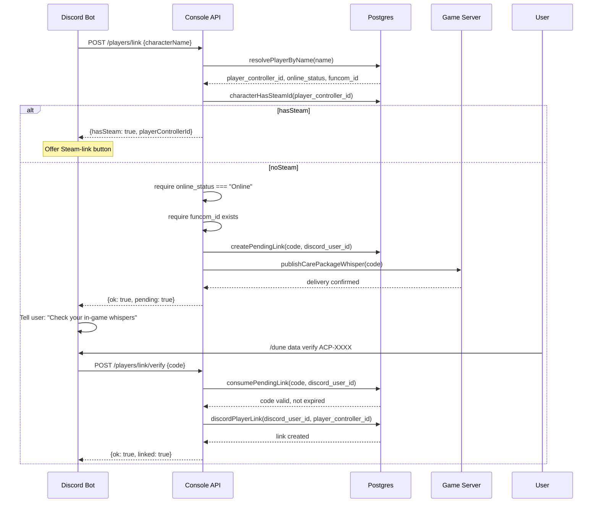
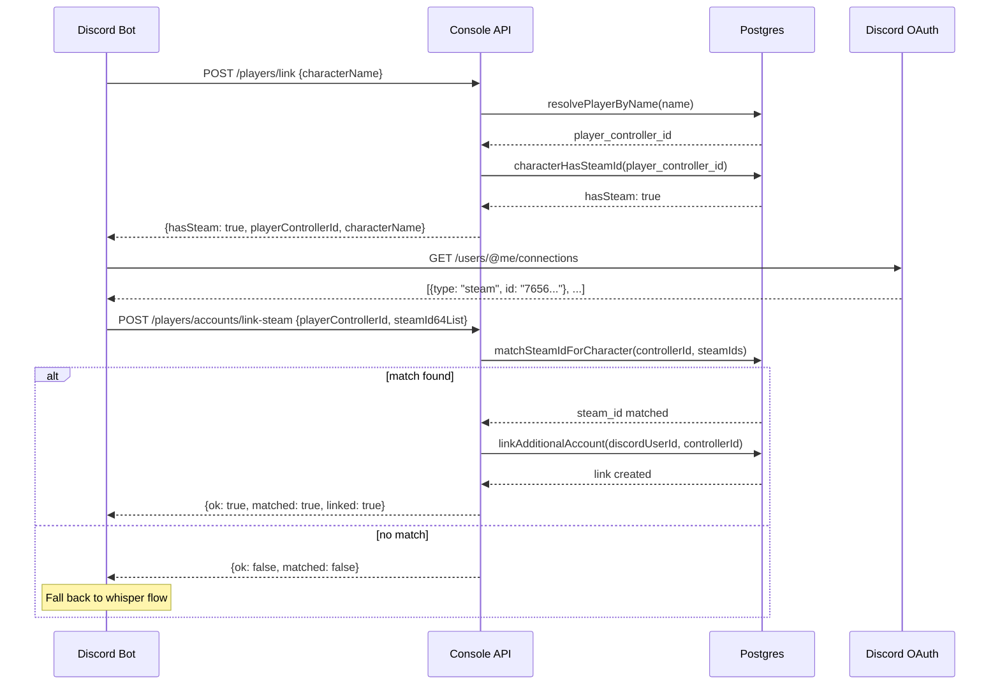

# Discord Player-Character Linking — Security Architecture

**Date:** 2026-08-08
**Status:** Active (phase one: 1:1 linking)
**Related:** `docs/security/discord-player-link-hardening.md`

---

## Design Principle

A Discord user must **prove ownership** of an in-game character before the
console grants access to that character's data. Proof is established through
one of two independent channels:

1. **In-game whisper code** — the character must be online; a 6-character code
   is delivered privately in-game, then submitted back via the Discord bot
2. **Steam identity match** — if the character's Funcom account has a linked
   Steam platform ID, and the Discord user has completed Steam OAuth through
   Discord, the SteamID64 match proves ownership without requiring the
   character to be online

Neither channel relies on Discord identity alone. The system trusts Discord's
OAuth `connections` scope as proof of Steam account ownership, and the game
server's `dune.accounts` table as proof of character-to-Steam mapping.

---

## Flow Diagrams

### Whisper-Code Flow (Online Character)



### Steam-Identity Flow (Offline Character)



---

## Authentication Chain

Every link/unlink/verify request passes through these gates in order:

### Gate 1: Bot Token Validation
```
Header: Authorization: Bearer <token>
```
Constant-time comparison (`timingSafeEqual`) against `DUNE_DISCORD_ADAPTER_TOKEN`.
Rejects with `401 missing_bot_token` or `401 invalid_bot_token`.

### Gate 2: Actor Signature Validation (when `DUNE_DISCORD_ACTOR_SECRET` is set)
```
JSON body: { ..., actor: { userId, guildId, channelId, roleIds, interactionId } }
Header: X-Dune-Actor-Signature: <hex(HMAC-SHA256(secret, canonicalPayload))>
Header: X-Dune-Actor-Timestamp: <unix-seconds>
```
The signature covers: `{route, userId, guildId, channelId, roleIds,
interactionId, timestamp}`. 30-second freshness window. Prevents replay of
a signature captured from a different route or interaction. Rejects with
`403 invalid_actor_signature`.

### Gate 3: Actor Structure Validation
```
Required fields: id, username, discriminator, guildId, channelId, roles
```
Must be a valid Discord-user-snowflake guild member structure.

### Gate 4: Self-Scoped Capability Check
```
requireSelfScopedCapability(actor, mapping, PLAYER_LINK_WRITE)
```
The `discordUserId` used in the link operation is **always `actor.userId`** —
never a caller-supplied target. The capability tier gates whether the user has
any access at all (`public` tier = rejected); it does not gate WHICH character
they can link.

---

## Database Schema (Console Schema, Postgres)

### `console.discord_player_links` — single-link table
| Column | Type | Constraint |
|--------|------|------------|
| `discord_user_id` | text | PRIMARY KEY |
| `player_controller_id` | text | NOT NULL, UNIQUE INDEX |
| `linked_at` | timestamptz | NOT NULL, DEFAULT now() |

One Discord user → one character. Re-linking overwrites.

### `console.discord_account_links` — multi-account table
| Column | Type | Constraint |
|--------|------|------------|
| `id` | bigint | GENERATED ALWAYS AS IDENTITY PRIMARY KEY |
| `discord_user_id` | text | NOT NULL |
| `player_controller_id` | text | NOT NULL |
| `is_default` | boolean | NOT NULL, DEFAULT false |
| `linked_at` | timestamptz | NOT NULL, DEFAULT now() |

Indexes:
- UNIQUE `(discord_user_id, player_controller_id)` — no duplicate same-pair links
- UNIQUE `(player_controller_id)` — one character → one Discord user
- UNIQUE `(discord_user_id) WHERE is_default` — at most one default

### `console.discord_pending_links` — single-link verification codes
| Column | Type | Constraint |
|--------|------|------------|
| `code` | text | PRIMARY KEY |
| `discord_user_id` | text | NOT NULL, UNIQUE INDEX |
| `player_controller_id` | text | NOT NULL, UNIQUE INDEX |
| `character_name` | text | NOT NULL |
| `created_at` | timestamptz | NOT NULL, DEFAULT now() |
| `expires_at` | timestamptz | NOT NULL |

### `console.discord_pending_account_links` — multi-account verification codes
Same structure, but uniqueness is on `(discord_user_id, player_controller_id)`
composite (allows a user to have multiple pending verifications for different
characters simultaneously).

### Cross-Table Invariants

Both `discordPlayerLink()` and `linkAdditionalAccount()` check **both** tables
for a conflicting owner using `FOR UPDATE` row locks inside a transaction. A
character cannot be owned by two different Discord users regardless of which
table the conflicting link lives in.

---

## Security Properties

### What an attacker CANNOT do

| Attack | Defense |
|--------|---------|
| Link someone else's character without proof | Must either be online as the character (receive whisper) or own the Steam account that character is linked to |
| Enumerate character-to-Steam-ID mappings | `matchSteamIdForCharacter()` is never exposed as a standalone route; it's only callable inside `linkAccountViaSteamProvider()` which carries the caller's authenticated Discord identity |
| Brute-force verification codes | 5 attempts per 5min window, 50 global, 15min lockout. 6-char code from 32-symbol alphabet (~30 bits). Expires in 5 minutes. |
| Claim an already-linked character | `FOR UPDATE` row locks serialize across both tables; second linker gets `409 character_already_linked` (generic — no owner identity leaked) |
| Spoof actor identity | HMAC-SHA256 signature bound to `(route, userId, guildId, channelId, roleIds, interactionId, timestamp)` with 30s window |
| Link through a stolen bearer token | Token is validated with constant-time comparison; actor signature requires the signing secret |
| Escalate privilege via role IDs | `requireSelfScopedCapability` only authorizes for the actor's own `discordUserId`; tier gates access/no-access, not which character |

### What is NOT enforced

| Gap | Severity | Mitigation |
|-----|----------|------------|
| Actor signing is opt-in | HIGH | `DUNE_DISCORD_ACTOR_SECRET` unset by default; bot-side signing not yet integrated |
| No nonce replay (30s window) | MEDIUM | Requires server-side nonce store |
| No audit on multi-account link/unlink | LOW | Follow-up item |
| No limit on linked accounts per user | LOW | Phase-one 1:1 gate makes this moot |
| In-memory rate limit state lost on restart | LOW | Matches pre-existing login limiter |
| Unbounded rate-limit key growth | LOW | Follow-up for all limiter instances |

---

## Rate Limiting

Three independent limiter instances, all tunable via environment variables:

| Limiter | Default: per-user | Default: global | Window | Env prefix |
|---------|-------------------|-----------------|--------|------------|
| Single-link verify | 5 attempts | 50 total | 5 min | `DUNE_DISCORD_LINK_VERIFY_*` |
| Multi-account verify | 5 attempts | 50 total | 5 min | `DUNE_DISCORD_ACCOUNT_LINK_VERIFY_*` |
| Steam link | 5 attempts | 50 total | 5 min | `DUNE_DISCORD_STEAM_LINK_*` |

A successful verification clears the failure count for that key. Rate-limit
responses include `retryAfterSeconds` in the response body.

---

## Error States — Complete Reference

| Condition | HTTP | Response |
|-----------|------|----------|
| Missing bot token | 401 | `missing_bot_token` |
| Invalid bot token | 401 | `invalid_bot_token` |
| Invalid actor signature | 403 | `invalid_actor_signature` |
| `public`-tier actor on link route | 403 | `not_authorized` |
| Empty character name | 400 | `characterName is required` |
| No character found | 200 | `{ok: false, error: "No player found matching..."}` |
| Ambiguous name match | 200 | `{ok: false, error: "Multiple players found: ...", candidates: [...]}` |
| Character offline (whisper) | 200 | `{ok: false, error: "must be online to receive..."}` |
| No Funcom identity | 200 | `{ok: false, error: "No active Funcom identity found"}` |
| Already-linked, same character | 200 | `{ok: true, alreadyLinked: true}` |
| Already-linked, different character | 200 | `{ok: false, error: "Your voice already answers to <name>"}` |
| Verification code already pending | 200 | `{ok: false, error: "A verification request is already pending"}` |
| Whisper delivery failed | 503 | `{ok: false, error: "verification_delivery_failed"}` |
| Invalid/expired verify code | 200 | `{ok: false, error: "Invalid or expired verification code"}` |
| Rate limited on verify | 429 | `{ok: false, error: "verify_rate_limited", retryAfterSeconds}` |
| Character already linked to another user | 409 | `character_already_linked` |
| Steam match failure | 200 | `{ok: false, matched: false}` |

---

## Multi-Account Extension (Phase Two — Deferred)

The infrastructure for one-Discord-user-to-multiple-characters exists and is
tested, but the phase-one 1:1 gate (`linkAdditionalAccount()`) is enforced
until `guild-character-grants` (or equivalent player-side "choose active
character" UX) exists. Multi-account uses the `console.discord_account_links`
table (composite `(discord_user_id, player_controller_id)` uniqueness)
separate from the legacy single-link table.

---

## Migration from Legacy Tables

Four tables were originally created in the `dune` schema (vendor-owned).
They have been migrated to `console` (project-owned) with these properties:
- Migration is idempotent: `IF NOT EXISTS` for all CREATE statements
- No data loss: original `dune.*` tables were confirmed empty on the only
  known live deployment before dropping
- Read compatibility: `getLinkedPlayer()` reads the legacy table first,
  then falls back to the multi-account table's default. All existing read
  routes work for users linked via either table.
- `getAllLinkedPlayers()` UNIONs both tables
- Stale link cleanup: rows referencing deleted characters are removed at
  schema initialization time

---

## Steam-ID Validation

SteamID64 validation uses a 17-digit regex (`/^[0-9]{17}$/`) to filter
well-formed entries from the input list before database querying. A
future iteration should add BigInt arithmetic for individual-account
verification (account type bit + account number calculation) before
re-enabling the Steam link flow.

---

## Test Coverage

| Test file | Lines | What it covers |
|-----------|-------|----------------|
| `discordLinkProvider.test.js` | 774 | Full whisper flow: success, offline, no-Funcom-ID, already-linked, code collision, verify rate-limit, cross-table ownership conflict |
| `discordMultiAccountLinkProvider.test.js` | 668 | Multi-account: link second character, default promotion, Steam-ID match, cross-table conflict |
| `discordCrossLinkInvariant.test.js` | 328 | Cross-table invariants: same character cannot be linked from both tables |
| `discordPolicy.test.js` | 116 | Capability gating: public-tier rejection, self-scoping enforcement |
| `discordActorSignature.test.js` | 134 | HMAC signature validation: valid, expired, tampered, missing |
| `discordAdapter.test.js` | 774 | Adapter integration: bearer token, route dispatch, error propagation |
